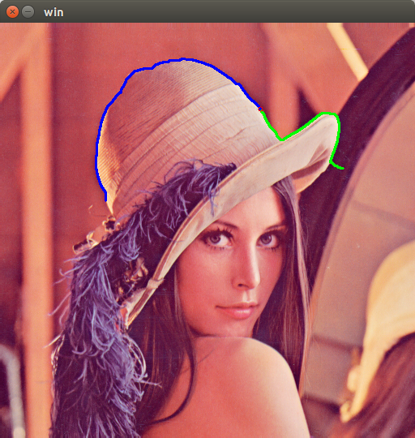
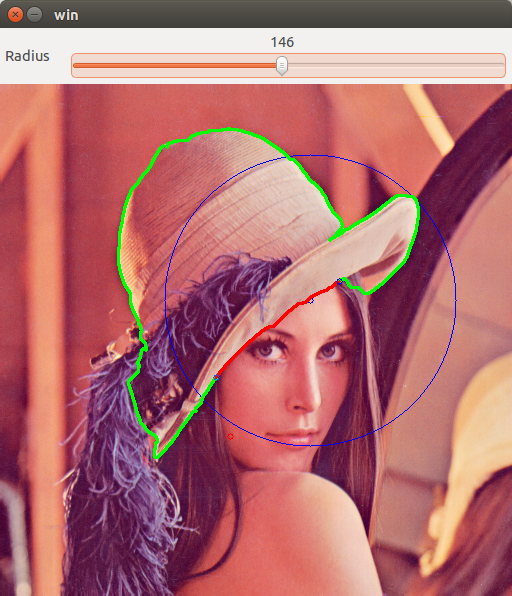
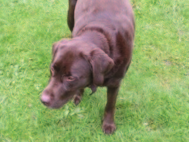
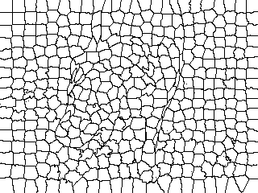
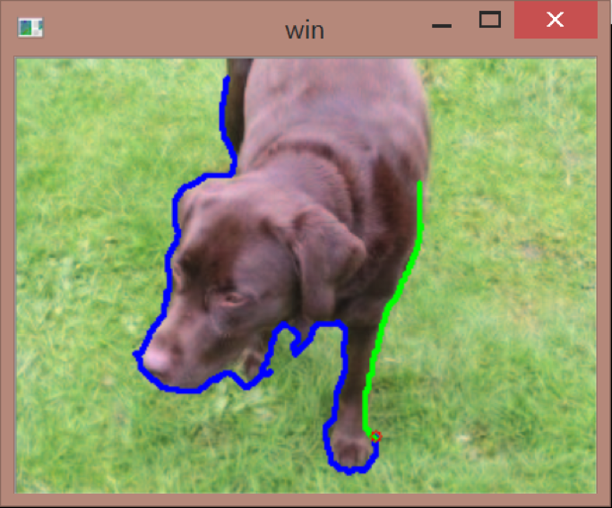

# LiveWire_OpenCV

Classic LiveWire algorithm and Contour-Draggable-LiveWire realization

Dependecy: [OpenCV](http://opencv.org/)

*Build:*
```
cd $PATH_TO_THIS_REPO
mkdir build
cd ./build
cmake ..
make -j4
````

## lena

<p align="center">
  
  
  
</p>

## dog

<p align="center">
  
  
  
</p>
